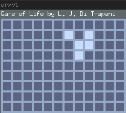
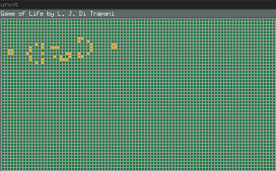

Conway's Game of Life on 2-D toroidal grid in Scala & JavaFX.




Download Standalone jar
-----------------------

<http://ditrapani.info/resources/game-of-life-assembly-1.4.1.jar>


Usage
-----

Example

    java \
    --module-path $PATH_TO_FX --add-modules=javafx.graphics \
    -jar game-of-life-assembly-x.x.x.jar --b=2

For more details and list of built-in game boards:

    java \
    --module-path $PATH_TO_FX --add-modules=javafx.graphics \
    -jar game-of-life-assembly-x.x.x.jar --help

See
[src/main/resources/help.txt](https://github.com/lj-ditrapani/game-of-life-scala/blob/master/src/main/resources/help.txt)
for documentation.


Dependencies
------------

Requires Java 11 and openjfx 11.0.1.

Install javafx 11.0.1:  https://openjfx.io/openjfx-docs/#install-javafx

run the jar with --module-path $PATH_TO_FX --add-modules=javafx.graphics


Dev
---

Generate a standalone jar for java 11

    sbt assembly

The jar will be placed in target/scala-x.xx/game-of-life-assembly-x.x.x.jar

Static analysis:  I'm using scalafmt, wartremover and scalastyle.
The compile task also runs scalafmt & wartremover.

    sbt test            # or anything that runs compile
    sbt scalastyle
    sbt test:scalastyle

Test coverage

    sbt clean coverage test
    sbt coverageReport

Check for dependency updates

    sbt dependencyUpdates


Examples
--------



Invocation:

```
java -jar game-of-life-assembly-x.x.x.jar --m=2 --w=4 --b=8 --t=250 \
    --bg-color=155,155,155 --alive-color=250,180,0 --dead-color=0,120,50
```


Invocation:

```
java -jar game-of-life-assembly-x.x.x.jar --m=1 --w=4 --b=5 --t=250 \
    --bg-color=50,0,0 --alive-color=255,180,210 --dead-color=0,50,130
```


Making GIF Animations
---------------------

To make the gif animations, I used byzanz:

    sudo apt-get install byzanz
    byzanz-record --duration=20 --x=0 --y=0 --width=500 --height=300 out.gif


TODO
----

- Review new free monad design: compare; worth keeping?
- Review file names & content
- Review organization
- Interpret free monad to Task instead of doing effects directly
- Use Task for effects; combine with Task from free monad natural transformation
- Use EitherT[Effect, A] to eliminate double either unwrapping in main
- terminator should call close on javafx Application before exit (in place of exit?)?
- fully test main; (scoverage: 2 error cases untested)
- Hows about a time based test that ensures the stepper and animator
  render the first frame and subsequest frame correctly?

- Consider using 2 mutable grids Array[Array[Cell]] dimOf and a aliveCount Array[Array[Int]]
    - one grid is put in AtomicRef for rending and the other is used to to compute the next grid
    - each frame, they swap
    - First, test performance diff; then implement if worth it
- try scalamock; switch to scalamock if you like it
